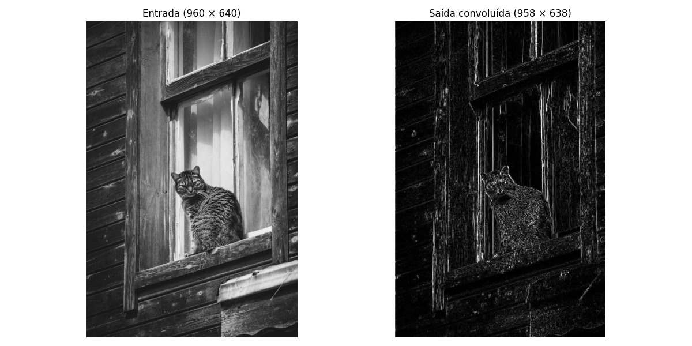
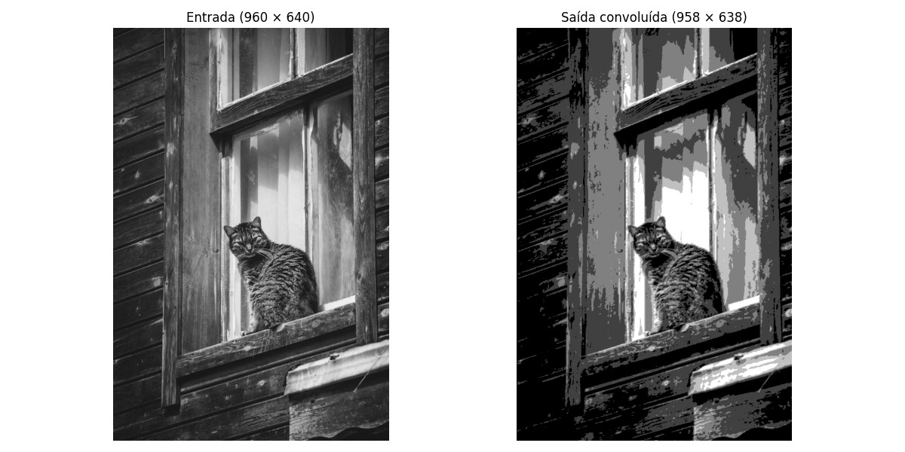
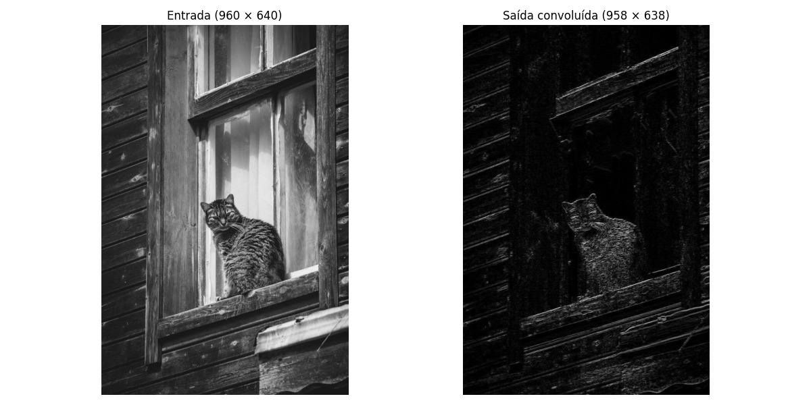

🇺🇸 [English](README.md) | 🇧🇷 [Português](README.pt.md)

# 2D Convolution Engine for FPGA

[](LICENSE)
[]()
[]()
[](https://github.com/ManoelIvisson/convulucao-2d-FPGA-Litex)

## Table of Contents

- [Overview](#overview)
- [Features](#features)
- [Architecture](#architecture)
- [Module Descriptions](#module-descriptions)
- [Parameters](#parameters)
- [Usage Examples](#usage-examples)
- [Getting Started](#getting-started)
- [Scripts and Tools](#scripts-and-tools)
- [Simulation](#simulation)
- [Synthesis and Implementation](#synthesis-and-implementation)
- [Performance](#performance)
- [Applications](#applications)
- [Troubleshooting](#troubleshooting)
- [Project Structure](#project-structure)
- [Contributing](#contributing)
- [License](#license)
- [Contact](#contact)
- [Acknowledgments](#acknowledgments)

## Overview

This project implements a **high-performance 2D convolution engine** designed for FPGA platforms. It processes 8-bit grayscale images using configurable 3×3 convolution kernels, ideal for real-time image processing applications such as edge detection, blurring, sharpening, and other computer vision tasks.

The design uses a streaming architecture with line buffers, enabling efficient processing of images of arbitrary height with minimal memory overhead.

## Features

- ✅ **3×3 Convolution Kernel**: Fully configurable coefficients
- ✅ **Streaming Architecture**: Processes one pixel per clock cycle
- ✅ **Parameterizable Design**: Configurable bit widths and image dimensions
- ✅ **Line Buffer**: Efficient memory usage for arbitrary image heights
- ✅ **Edge Handling**: Zero-padding for border pixels
- ✅ **Optional Absolute Value**: For gradient magnitude (Sobel, etc.)
- ✅ **Configurable Normalization**: Programmable bit-shift for output scaling
- ✅ **Pipeline Architecture**: Optimized for high clock frequencies
- ✅ **Overflow Protection**: Automatic clamping to valid pixel range

## Architecture

```
┌─────────────────────────────────────────────────────────────┐
│                         conv_top                            │
│                                                             │
│  ┌──────────────┐    ┌─────────────┐    ┌──────────────┐  │
│  │   Kernel     │    │ Line Buffer │    │     MAC9     │  │
│  │   Storage    │───▶│   (3x3)     │───▶│  Multiply &  │  │
│  │   (9 coefs)  │    │  Window     │    │  Accumulate  │  │
│  └──────────────┘    └─────────────┘    └──────────────┘  │
│         ▲                   ▲                    │         │
│         │                   │                    ▼         │
│    kernel_wr           valid_in             ┌────────┐    │
│    kernel_addr          px_in               │ Norm & │    │
│    kernel_data                              │ Clamp  │    │
│                                             └────────┘    │
│                                                  │         │
│                                                  ▼         │
│                                            valid_out       │
│                                            px_out          │
└─────────────────────────────────────────────────────────────┘
```

### Data Flow

1. **Input Stream**: Pixels arrive sequentially (left-to-right, top-to-bottom)
2. **Line Buffer**: Maintains a 3×3 sliding window across rows
3. **MAC Unit**: Performs 9 multiply-accumulate operations in parallel
4. **Normalization**: Applies optional absolute value and bit-shift
5. **Clamping**: Ensures output stays within valid range [0, 255]
6. **Output Stream**: Processed pixels output with `valid_out` signal

## Module Descriptions

### conv_top

**Top-level module** integrating all submodules and controlling the convolution pipeline.

**Ports:**

- `clk`, `rstn`: Clock and active-low reset
- `valid_in`, `px_in`: Input pixel stream
- `kernel_wr`, `kernel_addr`, `kernel_data`: Kernel programming interface
- `valid_out`, `px_out`: Output pixel stream

### linebuffer_3x3

**Line buffer implementation** that maintains the sliding 3×3 window across image rows.

**Key Features:**

- Stores two previous rows in internal RAM
- Uses shift registers for current row
- Handles edge cases with zero-padding
- Outputs valid window signals

### mac9

**Multiply-Accumulate Unit** performing the convolution computation.

**Operation:**

```
result = Σ(pixel[i] × kernel[i])  for i = 0 to 8
```

**Features:**

- Parallel multiplication of 9 pixel-coefficient pairs
- Pipelined adder tree for accumulation
- Signed arithmetic for negative kernels

## Parameters

| Parameter | Default | Description                                 |
| --------- | ------- | ------------------------------------------- |
| `PIX_W`   | 8       | Pixel bit width (typically 8 for grayscale) |
| `COEF_W`  | 16      | Coefficient bit width (signed)              |
| `ACC_W`   | 32      | Accumulator bit width                       |
| `IMG_W`   | 128     | Image width in pixels                       |
| `USE_ABS` | 1       | Enable absolute value (1=yes, 0=no)         |
| `SHIFT`   | 0       | Right shift for normalization               |

## Usage Examples

## 📸 Visual Examples

### Edge Detection (Sobel)

| Input                           | Output                          |
| ------------------------------- | ------------------------------- |
|  |  |

**Sobel-X Kernel:**

```
┌────┬───┬────┐
│ -1 │ 0 │  1 │
├────┼───┼────┤
│ -2 │ 0 │  2 │
├────┼───┼────┤
│ -1 │ 0 │  1 │
└────┴───┴────┘
```

### Sharpening

| Input                           | Output                            |
| ------------------------------- | --------------------------------- |
|  |  |

**Sharpening Kernel:**

```
┌────┬────┬────┐
│  0 │ -1 │  0 │
├────┼────┼────┤
│ -1 │  5 │ -1 │
├────┼────┼────┤
│  0 │ -1 │  0 │
└────┴────┴────┘
```

### Edge Detection (Laplacian)

| Input                           | Output                              |
| ------------------------------- | ----------------------------------- |
|  |  |

**Laplacian Kernel:**

```
┌────┬────┬────┐
│  0 │ -1 │  0 │
├────┼────┼────┤
│ -1 │  4 │ -1 │
├────┼────┼────┤
│  0 │ -1 │  0 │
└────┴────┴────┘
```

### Example 1: Gaussian Blur (3×3)

```
Kernel:
┌───┬───┬───┐
│ 1 │ 2 │ 1 │
├───┼───┼───┤
│ 2 │ 4 │ 2 │
├───┼───┼───┤
│ 1 │ 2 │ 1 │
└───┴───┴───┘
Total: 16 → Use SHIFT=4
```

**Configuration:**

```systemverilog
conv_top #(
  .PIX_W(8),
  .IMG_W(640),
  .USE_ABS(0),
  .SHIFT(4)
) blur_inst (...);
```

**Kernel Programming:**

```systemverilog
kernel[0] = 1; kernel[1] = 2; kernel[2] = 1;
kernel[3] = 2; kernel[4] = 4; kernel[5] = 2;
kernel[6] = 1; kernel[7] = 2; kernel[8] = 1;
```

**Effect:** Smooths the image by averaging neighboring pixels

### Example 2: Sobel Edge Detection (Horizontal)

```
Kernel:
┌────┬───┬────┐
│ -1 │ 0 │  1 │
├────┼───┼────┤
│ -2 │ 0 │  2 │
├────┼───┼────┤
│ -1 │ 0 │  1 │
└────┴───┴────┘
```

**Configuration:**

```systemverilog
conv_top #(
  .PIX_W(8),
  .IMG_W(640),
  .USE_ABS(1),  // Use absolute value
  .SHIFT(8)
) sobel_x_inst (...);
```

**Kernel Programming:**

```systemverilog
kernel[0] = -1; kernel[1] = 0; kernel[2] = 1;
kernel[3] = -2; kernel[4] = 0; kernel[5] = 2;
kernel[6] = -1; kernel[7] = 0; kernel[8] = 1;
```

**Effect:** Detects vertical edges in the image

### Example 3: Sharpen Filter

```
Kernel:
┌────┬────┬────┐
│  0 │ -1 │  0 │
├────┼────┼────┤
│ -1 │  5 │ -1 │
├────┼────┼────┤
│  0 │ -1 │  0 │
└────┴────┴────┘
```

**Configuration:**

```systemverilog
conv_top #(
  .PIX_W(8),
  .IMG_W(640),
  .USE_ABS(0),
  .SHIFT(0)
) sharpen_inst (...);
```

**Effect:** Enhances edges and details in the image

### Example 4: Laplacian Edge Detection

```
Kernel:
┌────┬───┬────┐
│  0 │ -1 │  0 │
├────┼───┼────┤
│ -1 │  4 │ -1 │
├────┼───┼────┤
│  0 │ -1 │  0 │
└────┴───┴────┘
```

**Configuration:**

```systemverilog
conv_top #(
  .PIX_W(8),
  .IMG_W(640),
  .USE_ABS(1),  // Use absolute value
  .SHIFT(0)
) laplacian_inst (...);
```

**Effect:** Detects edges by highlighting regions of rapid intensity change

## Getting Started

### Prerequisites

- **HDL Simulator**: ModelSim, Vivado Simulator, or Verilator
- **FPGA Tools**: Xilinx Vivado or Intel Quartus (for synthesis)
- **Python**: For image preprocessing (optional)

### Quick Start

1. **Clone the repository**

```bash
git clone https://github.com/ManoelIvisson/convulucao-2d-FPGA-Litex.git
cd convulucao-2d-FPGA-Litex
```

2. **Prepare input image**

```python
# convert_image.py
from PIL import Image
import numpy as np

img = Image.open('input.png').convert('L')
img = img.resize((640, 480))
pixels = np.array(img)

with open('image_in.hex', 'w') as f:
    for pixel in pixels.flatten():
        f.write(f'{pixel:02x}\n')
```

3. **Run simulation**

```bash
# Using ModelSim
vlog conv_top.sv linebuffer_3x3.sv mac9.sv tb_conv.sv
vsim -c tb_conv -do "run -all"

# Using Vivado
vivado -mode batch -source sim_script.tcl
```

4. **View results**

```python
# view_output.py
import numpy as np
from PIL import Image

pixels = []
with open('out_pixels.hex', 'r') as f:
    for line in f:
        pixels.append(int(line.strip(), 16))

img_array = np.array(pixels).reshape(480, 640)
img = Image.fromarray(img_array.astype('uint8'))
img.save('output.png')
img.show()
```

## Scripts and Tools

The repository includes Python scripts for image processing:

- `convert_image.py`: Converts a PNG image to hex format for simulation input

  ```bash
  python convert_image.py input.png image_in.hex
  ```

- `view_output.py`: Converts hex output from simulation to PNG image
  ```bash
  python view_output.py out_pixels.hex output.png
  ```

Install dependencies: `pip install pillow numpy`

## Simulation

### Prerequisites

- **FPGA Tools**: Xilinx Vivado (recommended) or Intel Quartus Prime
- **Target Device**: Any modern FPGA (e.g., Xilinx Artix-7, Kintex-7, or equivalent)

### Steps for Vivado

1. **Create a new project in Vivado**

   - Open Vivado and select "Create Project"
   - Set project name and location
   - Choose "RTL Project" and add the RTL files: `rtl/conv_top.sv`, `rtl/linebuffer_3x3.sv`, `rtl/mac9.sv`

2. **Configure synthesis settings**

   - In Project Settings > Synthesis, set target language to SystemVerilog
   - Add any necessary constraints (e.g., clock constraints in a .xdc file)

3. **Run synthesis and implementation**

   ```bash
   # In Vivado Tcl console or batch mode
   synth_design -top conv_top -part xc7a35tcpg236-1
   opt_design
   place_design
   route_design
   write_bitstream -force conv_top.bit
   ```

4. **Generate reports**

   - Check timing reports for clock frequency
   - Verify resource utilization matches estimates

### For Quartus (Intel FPGA)

1. Create a new project in Quartus Prime
2. Add RTL files and set top-level entity to `conv_top`
3. Configure device family (e.g., Cyclone V)
4. Run compilation and generate .sof file

### Tips

- Monitor timing closure; adjust pipeline if needed
- Use DSP blocks for multipliers to optimize resource usage
- Test on hardware with a simple test pattern before full images

## Installation

The installation process for this custom SoC can be done by following the instructions below.

### Prerequisites

Before compiling the code, it is necessary to install and activate the following software in the development environment:

- [OSS CAD Suite](https://github.com/YosysHQ/oss-cad-suite-build)
- [LiteX](https://github.com/enjoy-digital/litex)
- [RISC-V GNU Toolchain Prebuilt](https://github.com/zyedidia/riscv-gnu-toolchain-prebuilt)

### Compilation

With the environment prepared, it is possible to compile the code by executing the following commands within the project's root folder:

Compile the SoC:
```sh
python3 build_soc.py
```

Enter the firmware directory:
```sh
cd firmware
```

Compile the code:
```sh
make
```

Return to the project root folder:
```sh
cd ../
```

Load the SoC onto the board:
```sh
sudo openFPGALoader -c cmsisdap --fpga-part LFE5U-45F build/gateware/colorlight_i9.bit
```

Open the terminal (remember to replace the COM port with the one connected to the board):
```sh
litex_term /dev/ttyACM0 --kernel ./firmware/main.bin --speed 115200
```

Press 'Enter' and load the firmware:
```sh
serialboot
```

Exit the terminal with CTRL+C and send image:
```sh
python3 send_image.py
```

## Performance

### Throughput

- **1 pixel per clock cycle** (after pipeline fill)
- For 100 MHz clock: **100 Megapixels/second**
- 640×480 image @ 100 MHz: **3.2 ms** (312 FPS)

### Latency

- Pipeline latency: **~5-7 clock cycles**
- Initial startup: **2 rows + 2 columns** before first valid output

### Resource Utilization (Typical for Xilinx 7-series)

| Resource | Usage    | Notes                        |
| -------- | -------- | ---------------------------- |
| LUTs     | ~500-800 | Varies with parameters       |
| FFs      | ~300-500 | Pipeline registers           |
| BRAMs    | 2        | Line buffers (for IMG_W=640) |
| DSPs     | 9        | Multipliers (MAC unit)       |

## Applications

### Computer Vision

- **Edge Detection**: Sobel, Prewitt, Laplacian
- **Image Smoothing**: Gaussian blur, average filter
- **Image Sharpening**: Unsharp mask, high-pass filters

### Video Processing

- Real-time video filtering
- Motion detection preprocessing
- Feature extraction

### Machine Learning

- Convolutional layer implementation
- Feature map generation
- CNN acceleration

### Scientific Imaging

- Medical image enhancement
- Microscopy image processing
- Satellite image analysis

## Troubleshooting

### Common Issues

- **Simulation fails with overflow**: Check kernel coefficients and SHIFT parameter. Ensure coefficients sum appropriately for normalization.
- **Timing violations in synthesis**: Reduce clock frequency or add pipeline stages. Monitor critical path in Vivado reports.
- **Incorrect output pixels**: Verify kernel programming order (row-major). Check image dimensions match IMG_W parameter.
- **BRAM usage high**: For larger IMG_W, consider external memory or adjust buffer size.
- **Python scripts fail**: Install dependencies: `pip install pillow numpy`. Ensure input image is grayscale.

### Debugging Tips

- Use waveform viewer to inspect `window_valid` and pixel streams
- Add debug signals for intermediate MAC results
- Test with simple kernels (e.g., identity) first

---

## 📁 Project Structure

```
convulucao-2d-FPGA-Litex/
├── firmware/
│   ├── linker.ld            # Firmware memory mapping
│   ├── main.c               # Firmware functions
│   └── Makefile             # Compilation commands
├── rtl/
│   ├── conv_top.sv          # Top-level module
│   ├── linebuffer_3x3.sv    # Line buffer implementation
│   └── mac9.sv              # MAC unit
├── testbench/
│   └── tb_conv.sv           # Testbench
├── build_soc.py             # SoC functions
├── conv_soc_wrapper.py      # Convolution SoC wrapper
├── convert_image.py         # Image to hex converter
├── send_image.py            # Image sender
├── view_output.py           # Output visualizer
└── README.md                # This file
```

## 🤝 Contributing

Contributions are welcome! Please feel free to submit a Pull Request.

## 📄 License

This project is licensed under the MIT License - see the LICENSE file for details.

## 📧 Contact

For questions or suggestions, please open an issue on GitHub.

## 🙏 Acknowledgments

- Inspired by classical image processing techniques
- Optimized for FPGA implementation efficiency
- Community feedback and contributions

---

**Note**: This is a hardware description, not software. Synthesis and implementation results will vary based on target FPGA device and tool settings.
